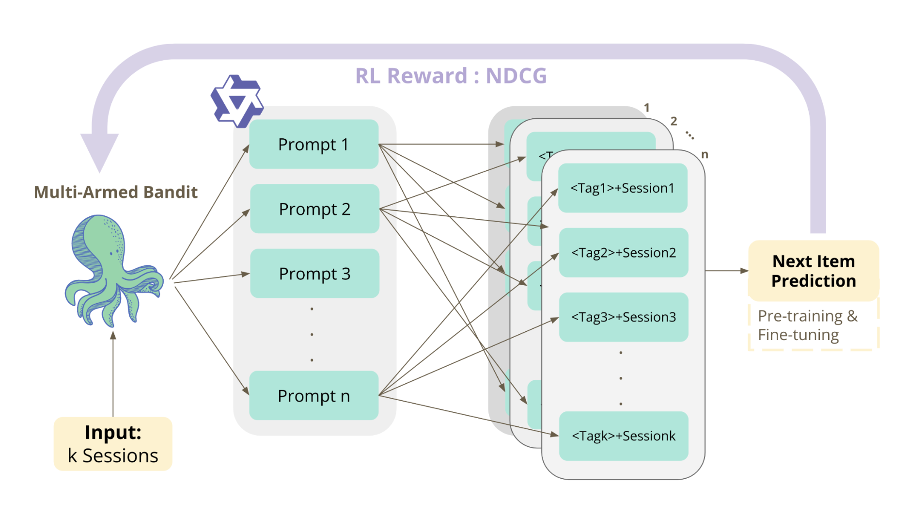
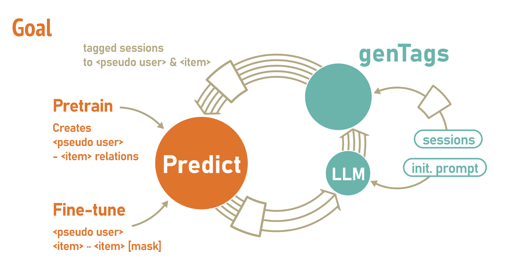

# PULLRS: Pseudo-User Large Language Recommendation System

> 📄 For setup instructions and usage examples, please refer to the [`PseudoUser`](./PseudoUser) folder’s README.

  

**PULLRS** is a novel Large Language Model (LLM)-based recommendation system that assigns interpretable **pseudo-user tags** to anonymous or session-only users. It enhances next-item prediction performance by combining prompt generation, reinforcement learning, and masked prediction techniques.

## 🧠 Motivation

In many real-world e-commerce platforms, new or anonymous users lack sufficient history for effective recommendations. Traditional user ID-based or description-based methods either introduce noise or semantic bias.

**PULLRS addresses this cold-start challenge** by:
- Generating **pseudo-user tags** (e.g., *seafood lover*, *fruit enthusiast*) based on user behavior.
- Using these tags to improve next-item predictions without requiring persistent user identities.

## 📦 Dataset

Sourced from **Freshfood by AviviD**:
- **Products**: 1000+ images and metadata (id, title, description, category, price)
- **Sessions**: 70,000+ sessions over 5 months
  - Includes: session ID, event time/type (load, purchase), product ID
- **Challenge**: Many sessions have no user ID, making cold-start recommendation critical.

## 🔍 Methodology

### 1. Prompt-Based Pseudo-User Tagging
- Uses **LLMs (e.g., Qwen3-4B)** to generate prompts:
  
  > Below are user e-commerce sessions. Divide them into approximately {m} tags based on browsing / purchase patterns...
- Tags like:
  - *High-end beef lover*
  - *Seafood enthusiast*
  - *Vegetable and fruit lover*
  - *Halal and vegetarian*

### 2. Next-Item Prediction Workflow

#### a. Pretraining Phase
- Each session is first tagged with a **pseudo-user label** generated by an LLM.
- These labeled sessions are used to pretrain the model, learning a general mapping from `<pseudo user>` to `<item>` relations.
- This phase establishes coarse-grained preferences across session clusters (e.g., seafood lovers tend to buy certain products).

#### b. Fine-tuning Phase
- The model is then fine-tuned using a masked language modeling approach:
  `<pseudo user> has bought <item_0>, <item_1>, <item_2>, [MASK]`

- This setup enables the model to perform next-item prediction by capturing sequential user behavior conditioned on the pseudo-user tag.
- The predictor leverages both the identity of the pseudo-user and the history of interactions for better personalization.

### 3. Reinforcement Learning Optimization

- Treats prompt selection as a **multi-armed bandit** problem.
- Uses the **Upper Confidence Bound (UCB)** algorithm to balance exploration and exploitation when selecting prompt variants.
- The UCB score for each prompt arm is computed as:

  $$
  \text{UCB}_i = \text{NDCG}_i + 0.01 * \sqrt{\frac{2 \log n}{n_i}}
  $$

  Where:
  - $\text{NDCG}_i$ is the average NDCG reward for prompt $i$
  - $n$ is the total number of prompt selections so far
  - $n_{i}$ is the number of times prompt $i$ has been selected

- The reward signal used to compute $\text{NDCG}_i$ is the **NDCG score** from the downstream next-item prediction model.

- This UCB-driven optimization loop helps the system dynamically discover and refine high-performing prompt templates during training.

## 📈 Results

| Model           | Hitrate@20 | Hitrate@40 | NDCG@100 |
|-----------------|------------|------------|-----------|
| Bert4Rec        | 0.1369     | 0.1837     | 0.0872    |
| CLLM            | 0.1483     | 0.2368     | 0.1151    |
| **PULLRS (ours)** | **0.2965** | **0.3342** | **0.4734** |

- **Outperforms state-of-the-art baselines**, including:
- BERT4Rec (CIKM '19)
- CLLM4Rec (WWW '24)

## 💡 Applications

- **Real-Time Tagging for New Users**  
Automatically assigns interpretable intent tags (e.g., *vegetarian*) during a session.
- **Privacy-Friendly**  
No need for user IDs or personal information.
- **Lightweight & Efficient**  
Runs on Qwen3-4B with a single RTX 4090 (24GB VRAM).

## 🔍 References

- Sun et al., **BERT4Rec**, arXiv:1904.06690  
- Zhu et al., **CLLM4Rec**, arXiv:2311.01343  
- Sun et al., **PO4SIR**, arXiv:2312.07552  

